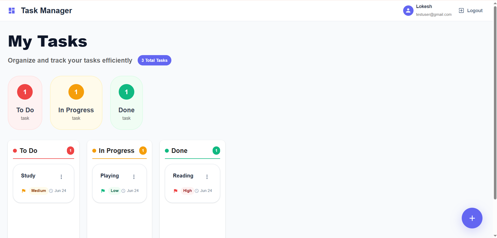

# 📋 Task Manager Web Application

---

## 📸 Screenshots

### 🔐 Authentication Pages

**Login Page**

**Registration Page**  

### 🎯 Main Dashboard

**Dashboard Overview**

**Task Management**

---

## ✨ Features

### 🔐 **Authentication & Security**
- ✅ User registration and login
- ✅ JWT token-based authentication
- ✅ Password hashing with bcrypt
- ✅ Protected routes and middleware
- ✅ Secure session management

### 📋 **Task Management**
- ✅ Create, read, update, delete tasks
- ✅ Task status tracking (To Do, In Progress, Done)
- ✅ Priority levels (High, Medium, Low)
- ✅ Task descriptions and timestamps
- ✅ Real-time UI updates

### 🎨 **User Interface**
- ✅ Modern Material UI design
- ✅ Responsive layout (mobile, tablet, desktop)
- ✅ Interactive task cards with hover effects
- ✅ Smooth animations and transitions
- ✅ Professional dashboard with statistics

### ⚡ **Performance & UX**
- ✅ Fast loading with optimized builds
- ✅ Loading states and skeleton screens
- ✅ Error handling and user feedback
- ✅ Form validation and input sanitization
- ✅ Accessibility features (ARIA labels)

---

## 🛠️ Tech Stack

### **Frontend**

### **Backend**

---

## 🚀 Quick Start

### Prerequisites
- Node.js (v14 or higher)
- MongoDB (local or Atlas)
- Git

### 📦 Installation

1. **Clone the repository**
   \`\`\`bash
   git clone https://github.com/yourusername/task-manager.git
   cd task-manager
   \`\`\`

2. **Install Backend Dependencies**
   \`\`\`bash
   cd backend
   npm install
   \`\`\`

3. **Install Frontend Dependencies**
   \`\`\`bash
   cd ../frontend
   npm install
   \`\`\`

4. **Environment Setup**
   
   Create `.env` file in the backend directory:
   \`\`\`env
   PORT=5000
   MONGO_URI=mongodb://localhost:27017/taskmanager
   JWT_SECRET=your_super_secret_jwt_key_here
   NODE_ENV=development
   \`\`\`

5. **Start the Application**
   
   **Backend (Terminal 1):**
   \`\`\`bash
   cd backend
   npm run dev
   \`\`\`
   
   **Frontend (Terminal 2):**
   \`\`\`bash
   cd frontend
   npm start
   \`\`\`

6. **Open your browser**
   \`\`\`
   http://localhost:3000
   \`\`\`

---

## 🔧 API Documentation

### Authentication Endpoints

| Method | Endpoint | Description | Body |
|--------|----------|-------------|------|
| `POST` | `/api/auth/signup` | Register new user | `{ name, email, password }` |
| `POST` | `/api/auth/login` | Authenticate user | `{ email, password }` |
| `GET` | `/api/auth/profile` | Get user profile | Headers: `Authorization: Bearer <token>` |

### Task Management Endpoints

| Method | Endpoint | Description | Body |
|--------|----------|-------------|------|
| `GET` | `/api/tasks` | Get all user tasks | Headers: `Authorization: Bearer <token>` |
| `POST` | `/api/tasks` | Create new task | `{ title, description, priority }` |
| `PUT` | `/api/tasks/:id` | Update task | `{ title, description, status, priority }` |
| `DELETE` | `/api/tasks/:id` | Delete task | Headers: `Authorization: Bearer <token>` |

---

## 🗄️ Database Schema

### User Model
\`\`\`javascript
{
  name: String (required, max: 50),
  email: String (required, unique, validated),
  password: String (required, min: 6, hashed),
  createdAt: Date (auto-generated)
}
\`\`\`

### Task Model
\`\`\`javascript
{
  title: String (required, max: 200),
  description: String (optional, max: 500),
  status: Enum ['To Do', 'In Progress', 'Done'],
  priority: Enum ['Low', 'Medium', 'High'],
  userId: ObjectId (ref: User),
  createdAt: Date (auto-generated)
}
\`\`\`

---

## 🧪 Testing

### Run Tests
\`\`\`bash
# Backend tests
cd backend
npm test

# Frontend tests
cd frontend
npm test
\`\`\`

### Test Coverage
- ✅ Authentication flow
- ✅ Task CRUD operations
- ✅ Route protection
- ✅ Form validation
- ✅ Error handling
- ✅ Responsive design

---

## 🎯 Usage Examples

### Creating a New Task
\`\`\`javascript
// API Call
const response = await axios.post('/api/tasks', {
  title: 'Complete project documentation',
  description: 'Write comprehensive README and API docs',
  priority: 'High'
}, {
  headers: { Authorization: `Bearer ${token}` }
});
\`\`\`

### Updating Task Status
\`\`\`javascript
// API Call
const response = await axios.put(`/api/tasks/${taskId}`, {
  status: 'In Progress'
}, {
  headers: { Authorization: `Bearer ${token}` }
});
\`\`\`

---

## 🔮 Future Enhancements

### Planned Features
- [ ] 🎯 Drag & drop functionality
- [ ] 🔍 Advanced search and filtering
- [ ] 🌙 Dark mode theme
- [ ] 📅 Due dates and reminders
- [ ] 👥 Team collaboration
- [ ] 📊 Analytics dashboard
- [ ] 📱 Mobile app (React Native)
- [ ] 🔔 Push notifications
- [ ] 📎 File attachments
- [ ] 🏷️ Task categories/tags

### Technical Improvements
- [ ] WebSocket for real-time updates
- [ ] Progressive Web App (PWA)
- [ ] Automated testing suite
- [ ] Docker containerization
- [ ] CI/CD pipeline
- [ ] API rate limiting
- [ ] Caching implementation
- [ ] Performance monitoring

---

## 🤝 Contributing

Contributions are welcome! Please feel free to submit a Pull Request.

### How to Contribute
1. Fork the project
2. Create your feature branch (`git checkout -b feature/AmazingFeature`)
3. Commit your changes (`git commit -m 'Add some AmazingFeature'`)
4. Push to the branch (`git push origin feature/AmazingFeature`)
5. Open a Pull Request

### Development Guidelines
- Follow existing code style
- Write meaningful commit messages
- Add tests for new features
- Update documentation as needed

---

## 👨‍💻 Author

**Lokesh K V**
- GitHub: https://github.com/lokeshvijay7
- Email: loki7cr@gmail.com

---

## 🙏 Acknowledgments

- [React](https://reactjs.org/) - Frontend library
- [Material-UI](https://mui.com/) - React component library
- [Node.js](https://nodejs.org/) - JavaScript runtime
- [Express](https://expressjs.com/) - Web framework
- [MongoDB](https://www.mongodb.com/) - Database
- [Vercel](https://vercel.com/) - Frontend deployment
- [Railway](https://railway.app/) - Backend deployment

---

